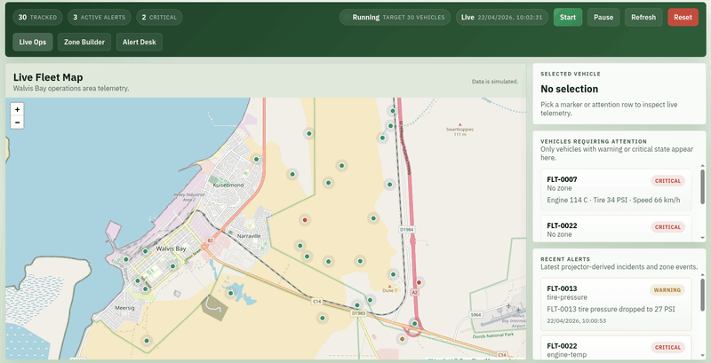
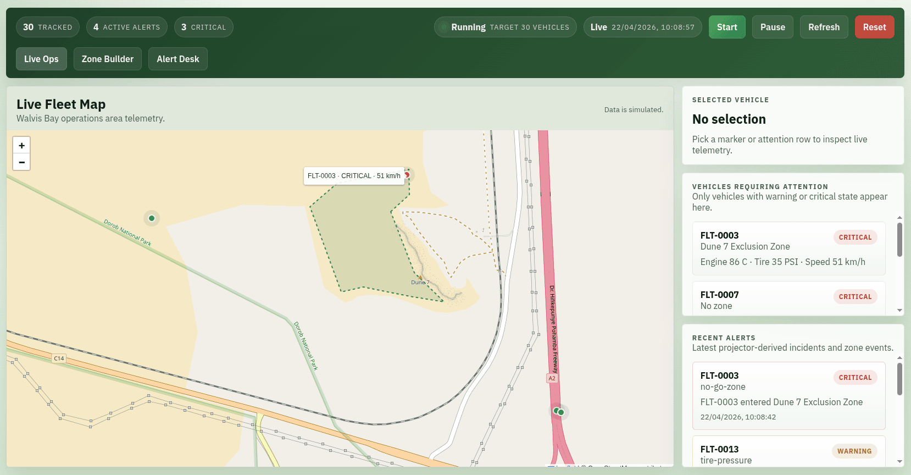
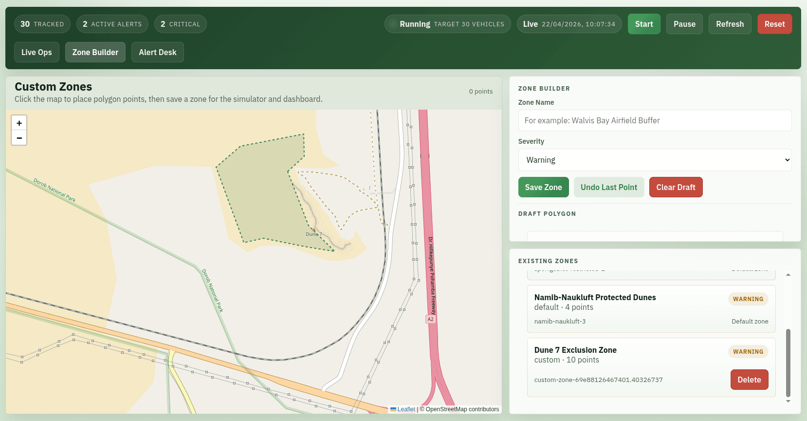
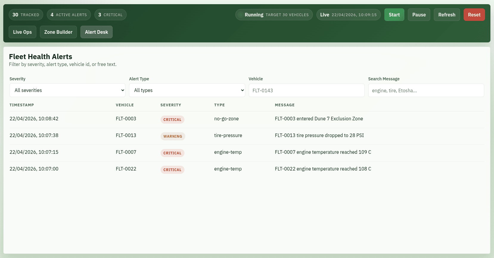

# Demo Fleet Tracker



This operations dashboard ingests live telemetry through Kafka, projects fleet state into Redis, and surfaces actionable alerts for a rental fleet. Vehicles are constrained to the Walvis Bay area to keep scope manageable. The interface also allows for the setting of restricted areas where the fleet is not allowed to operate, such as national parks. The zones carry severity levels (warning, critical) that influence the escalation of alerts when vehicles enter these areas.

## Screenshots

The dashboard allows you to start a simulation of 30 vehicles, watch them move across the map in real time, and see alerts for engine failures, low tire pressure, and entry into restricted zones.







## Architecture Summary

- `web`: PHP + Apache serves the single-page dashboard and JSON/SSE endpoints.
- `simulator`: PHP worker generates telemetry for 30 vehicles moving within a Walvis Bay operating polygon and publishes it to Kafka.
- `projector`: PHP worker consumes telemetry, matches vehicles against zones, derives alerts, and stores the latest fleet state in Redis.
- `kafka`: Single-node broker for `fleet.telemetry` and `fleet.alerts`.
- `kafka-init`: Bootstrap container that creates Kafka topics before the app services start.
- `redis`: Live projection store for vehicles, metrics, alerts, and simulation state.
- `kafka-ui`: Browser-based topic inspection and debugging UI.

## Data Flow

1. The dashboard calls `POST /api/simulation.php` to start the run.
2. The simulator publishes vehicle GPS, speed, engine temperature, and tire pressure events to Kafka.
3. The projector consumes those events, computes fleet health, and raises alerts for engine failures, low tire pressure, and entry into restricted zones.
4. Redis stores the current fleet snapshot.
5. The dashboard reads `/api/fleet.php`, `/api/alerts.php`, and `/api/events.php` to render live operations status.

## Scenario: Walvis Bay

- Fleet movement is limited to Walvis Bay.
- Restricted zones are:
  - Etosha National Park Core
  - Sperrgebiet Diamond Zone
  - Namib-Naukluft Protected Dunes

## Run Instructions

```bash
docker compose build --build-arg BUILDKIT_INLINE_CACHE=1
docker compose up -d
```

Then open:

- Dashboard: `http://localhost:8080`
- Kafka UI: `http://localhost:8081`

From the dashboard:

1. Click `Start Simulation`.
2. Watch 30 vehicles populate Walvis Bay and move within the operating area.
3. Review derived alerts in the right-hand operations panel.

## Operational Notes

- Kafka topics are created automatically by `kafka-init` during startup.
- If you change simulator or projector PHP code, restart those services so the long-running workers reload:

```bash
docker compose restart web simulator projector
```

- To stop and reset the demo, use the dashboard controls or run:

```bash
docker compose down
```